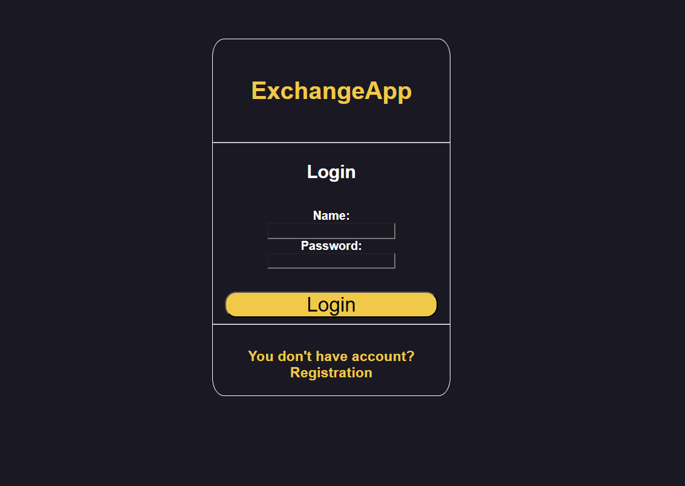
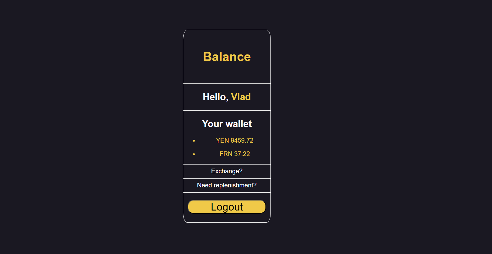
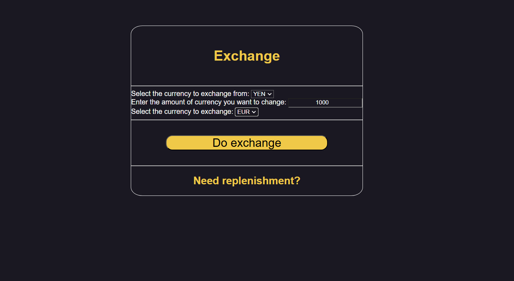

# I created pet-project Exchange App to practice my programing skills.

## Technologies
- **Spring framework** 🌿
  - MVC (Thymeleaf)
  - 🔒 Security
  - 📖 Data, Validation
  - 🐘 PostgreSQL
- HTML, CSS(+Bootstrap)

## Possibilities
- ⚙️ Create account
- 💰 Make replenishments and exchanges

## Screenshots

